\begin{minipage}{\textwidth}
{\Large Robotics Integration Group Project 1}\\[1mm]
{\large Lab 1 Experiment Report: Linux, C++ and Git Setup, plus RandomVector}\\[4mm]
\textbf{Huang Boyu 24020036026.}\\[1mm]
Ocean University of China, 24th Cohort Sino-Foreign CS Class 1.\\[1mm]
Lab date: 27th September 2026. Report date: 27th September 2026.
\end{minipage}

\bigskip

# Summary {-}

This report covers the whole Lab 1 workflow of the Robotics Integration Group Project: creating and logging into an Ubuntu 20.04.5 ARM64 virtual machine, backing up and switching the apt sources to the Tsinghua mirror, installing the essential toolchain (build-essential / CMake / Git), practicing basic Linux commands, Git version management, single-file C++ compilation with g++, a multi-file CMake project (`lab1_demo`), cloning the course repository (`ouc-vlab-course/vnav-codes`) and the personal submission repository (`hbyhby123/vnav-personal`), the Shell exercises (counting lines/words/non-blank lines of `dante.txt`, appending five `fortune` outputs), the C++ warm-up questions, and finally implementing all six member functions of the `RandomVector` class. The final program runs with the fixed seed `std::srand(314159)` and prints 20 random values, Mean 0.393617, Min 0.0667949, Max 0.999018 and a vertical `***` histogram with five min–max bins whose counts are 8, 1, 8, 2, 1 — exactly matching the example output on the course website, which confirms the implementation is correct and reproducible.

# Objectives and Environment

The goal of Lab 1 is to build the basic development workflow used throughout the course: operate files in Linux, manage code with Git, compile with g++ or CMake, and read, modify and verify C++ programs from the course repositories.

| Item | Actual environment |
|---|---|
| Hardware | MacBook Air (Apple silicon), VMware Fusion virtual machine |
| Operating system | Ubuntu 20.04.5 LTS, aarch64 (ARM64), hostname `ubuntu2004` |
| C/C++ compiler | gcc 9.4.0 / g++ 9.4.0 |
| Build tool | CMake 3.16.3 |
| Version control | Git 2.25.1 |
| Course repository | https://github.com/ouc-vlab-course/vnav-codes |
| Personal repository | https://github.com/hbyhby123/vnav-personal |
| Code baseline | MIT-SPARK/VNAV-labs (`lab1` folder) |

: Actual experiment environment.

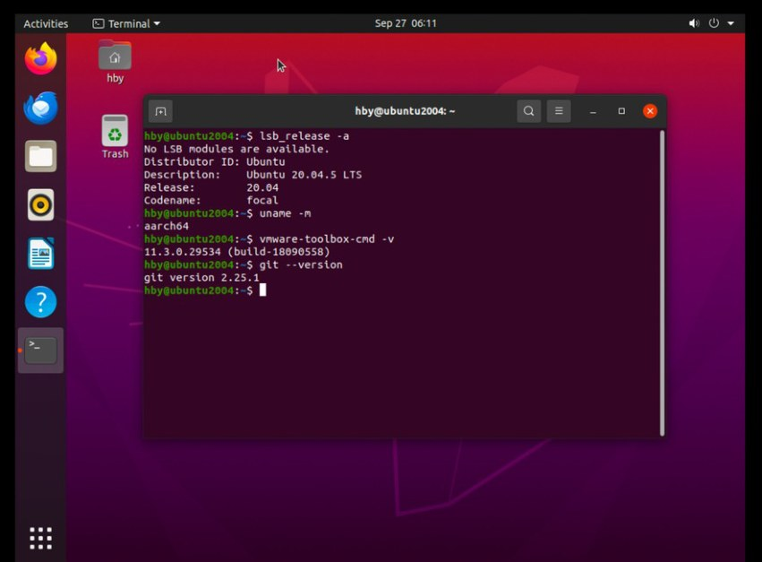

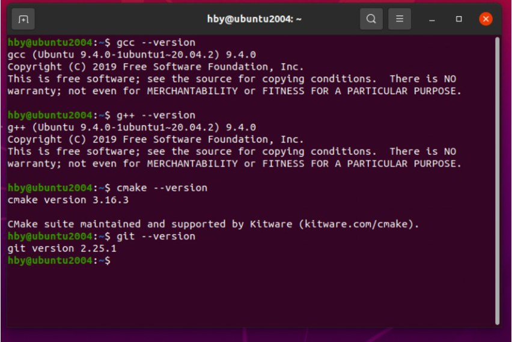

**Figure 01:** Ubuntu 20.04.5 LTS / aarch64 confirmed with `lsb_release -d` and `uname -m`; gcc, g++, cmake and git versions.

# Part One: Ubuntu 20.04 VM Installation

A new virtual machine was created in VMware Fusion from the `ubuntu-20.04.5-live-server-arm64.iso` image. After the first boot the system shows a terminal login prompt; after logging in and finishing the required configuration, the graphical desktop works normally. The course suggests NAT networking with host connection and DHCP enabled; in this environment GitHub and the apt mirrors were reachable, which proves the network works, although the individual settings were not shown separately.

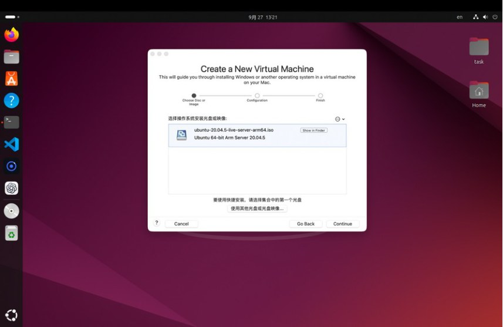

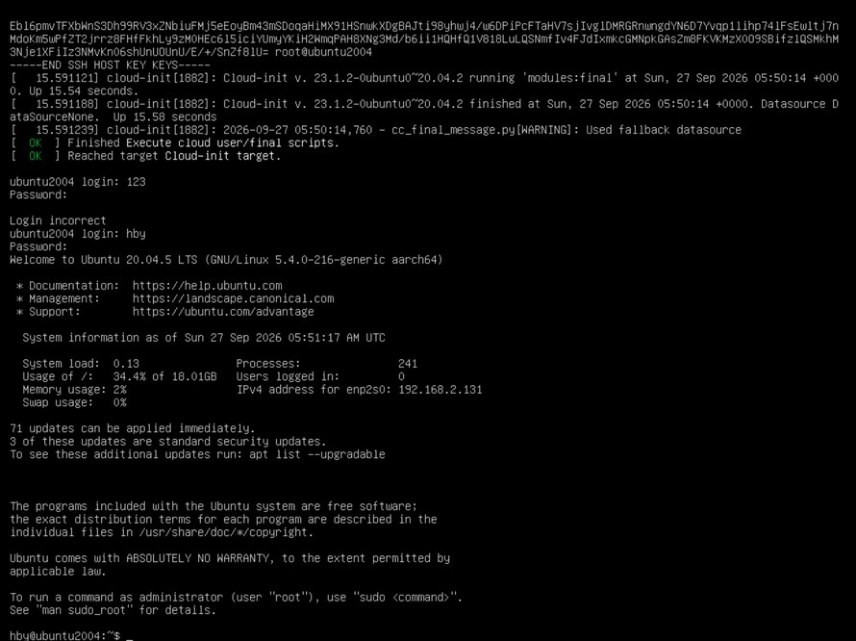

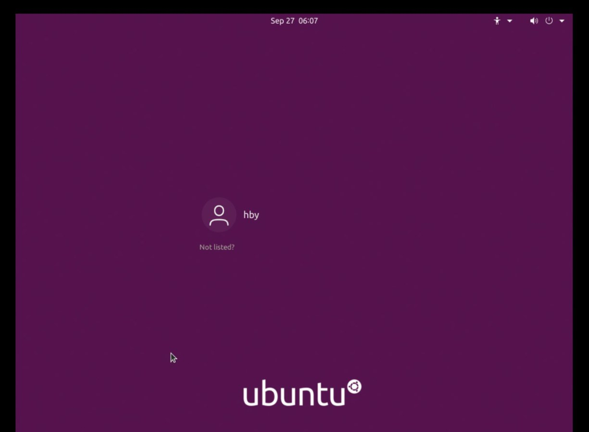

**Figure 02:** Creating the VM from the ARM64 image; first login at the text console; the graphical login screen after reboot.

# Part One: Backup and Switch to the Tsinghua Mirror

The effective Ubuntu sources were originally in `/etc/apt/sources.list.d/original.list` using the official `ubuntu-ports` addresses. Both files were backed up first, then the mirror addresses were rewritten into `sources.list` with `sed` and the old configuration was disabled to avoid duplicate entries:

```bash
sudo cp -n /etc/apt/sources.list /etc/apt/sources.list.bak
sudo cp -n /etc/apt/sources.list.d/original.list \
  /etc/apt/sources.list.d/original.list.bak
sudo sed 's|http://ports.ubuntu.com/ubuntu-ports/|https://mirrors.tuna.tsinghua.edu.cn/ubuntu-ports/|g' \
  /etc/apt/sources.list.d/original.list | sudo tee /etc/apt/sources.list
sudo mv /etc/apt/sources.list.d/original.list \
  /etc/apt/sources.list.d/original.list.disabled
sudo apt update
```

The release stays `focal`, with the `focal-updates`, `focal-backports` and `focal-security` components. Excerpt of the update output:

```text
Get:1 https://mirrors.tuna.tsinghua.edu.cn/ubuntu-ports focal InRelease
Get:2 https://mirrors.tuna.tsinghua.edu.cn/ubuntu-ports focal-updates InRelease
Get:3 https://mirrors.tuna.tsinghua.edu.cn/ubuntu-ports focal-backports InRelease
Get:4 https://mirrors.tuna.tsinghua.edu.cn/ubuntu-ports focal-security InRelease
Fetched 45.2 MB in 12s (3,826 kB/s)
Reading package lists... Done
Building dependency tree
Reading state information... Done
60 packages can be upgraded.
```

The package index was refreshed successfully. "60 packages can be upgraded" is only a status hint, not a failure; no system upgrade was performed in this step. `sources.list.bak` is the backup of the old `sources.list`, while the real old Ubuntu sources are kept as `original.list.bak`.

# Part Two: Essential Tools

```bash
sudo apt install build-essential cmake git
```

`dpkg-query` confirms all three packages are `install ok installed`:

| Package | Version |
|---|---|
| build-essential | 12.8ubuntu1.1 |
| cmake | 3.16.3-1ubuntu1.20.04.1 |
| git | 1:2.25.1-1ubuntu3.14 |

`build-essential` provides the basic compiler toolchain, CMake generates the build files of a project, and Git manages versions. The g++ compilation of RandomVector and the CMake build of `lab1_demo` below additionally prove that the toolchain works.

# Part Two: Linux Basic Commands

In `~/lab1` the basic filesystem operations were practiced: creating folders, entering directories, creating files, writing text and reading it back.

| Command | Meaning | Use in this lab |
|---|---|---|
| `ls` | List directory contents | Check that files/folders were created |
| `cd` | Change directory | Enter `lab1`, `test_folder`, etc. |
| `pwd` | Print working directory | Confirm the current path |
| `mkdir` | Make directory | Create the working directories |
| `touch` | Create an empty file | Create `hello.txt` |
| `echo` | Print / write text | Write `Hello Linux` into `hello.txt` |
| `cat` | Show file contents | Check what was written |

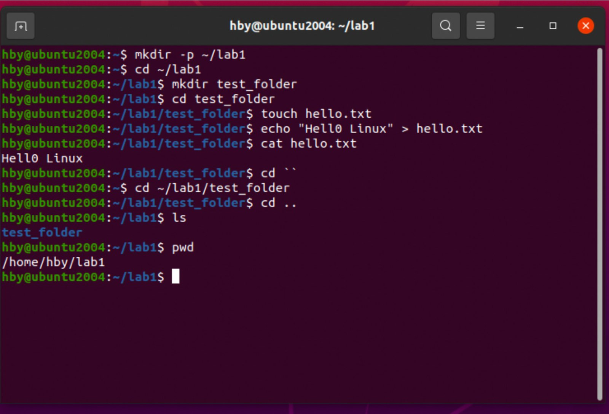

**Figure 03:** `mkdir test_folder`, `touch hello.txt`, `echo "Hello Linux" > hello.txt`, `cat hello.txt` and `ls` all work as expected.

# Part Three: Git Basics

In the `lab1_ws` directory a local repository was initialized with `git init`, a `README.md` test file was created, and the first commit required the global `user.name` / `user.email` configuration. Afterwards the commit succeeded and `git log --oneline` shows the history.

```bash
git init
git config --global user.name "hby"
git config --global user.email "..."   # fill in the email as prompted
git add README.md
git commit -m "first commit"
git log --oneline
```

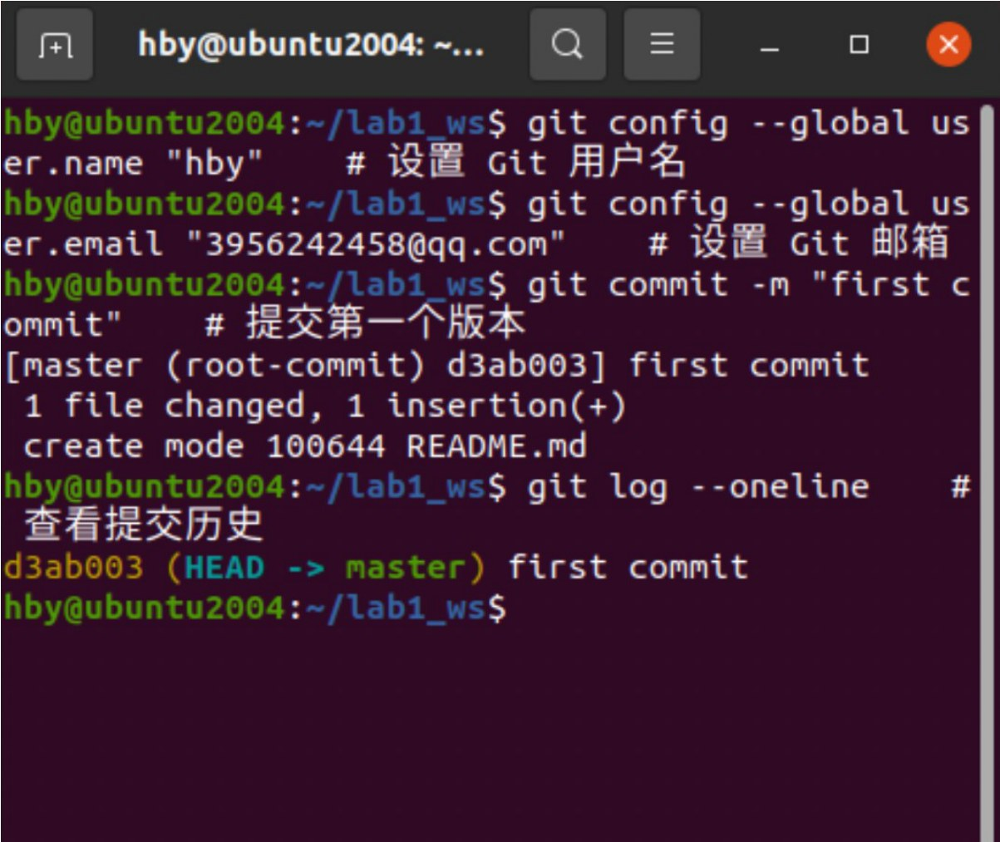

**Figure 04:** Git user configuration, the first commit and its history.

The full workflow is: clone/init to get a repository → `status`/`diff` to inspect changes → `add` to stage → `commit` to save a version → `push` to sync with the remote. Git is not only a "download tool": it records the modification history so that changes can be reviewed and rolled back, which is essential for teamwork.

# Part Three: C++ Single-File Compilation

The minimal compile-run loop was tested with `hello.cpp`:

```cpp
// hello.cpp
#include <iostream>
int main() {
    std::cout << "Hello C++" << std::endl;
    return 0;
}
```

```bash
g++ hello.cpp -o hello
./hello
# Hello C++
```

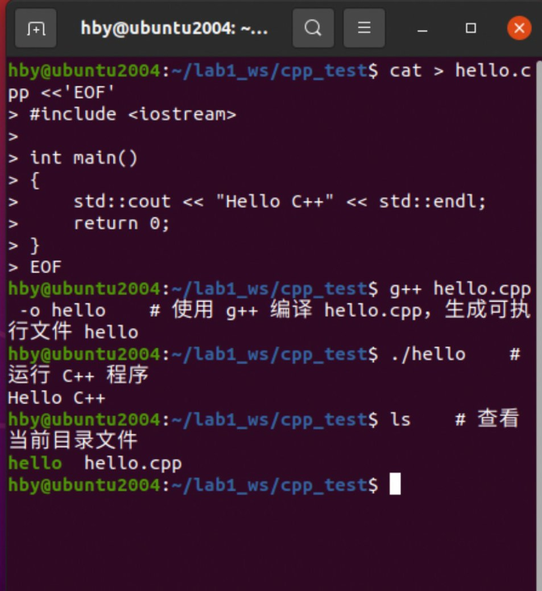

**Figure 05:** g++ compiles `hello.cpp` into `hello` and the program prints `Hello C++`.

# Part Three: CMake Multi-File Project

First a trivial `cmake_test` project was configured, built and run (`cmake . && make && ./hello`). Then the multi-file project `~/vnav-personal/lab1/lab1_demo` was created following the teacher's example, with `CMakeLists.txt`, `main.cpp`, `my_lib.hpp` and `my_lib.cpp`:

```cmake
cmake_minimum_required(VERSION 3.10)
project(hello_world VERSION 1.0 LANGUAGES CXX)
add_library(mylib my_lib.cpp my_lib.hpp)
add_executable(main main.cpp)
target_link_libraries(main PRIVATE mylib)
```

```cpp
// main.cpp
#include <iostream>
#include "my_lib.hpp"
int main() {
    std::cout << "Hello world!" << std::endl;
    std::cout << my_lib_function() << std::endl;
    return 0;
}
```

```bash
mkdir -p build
cd build
cmake .. && make && ./main
# Hello world!
# In library
```

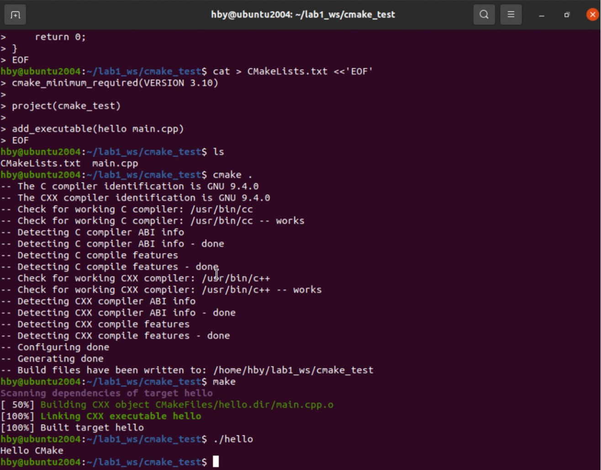

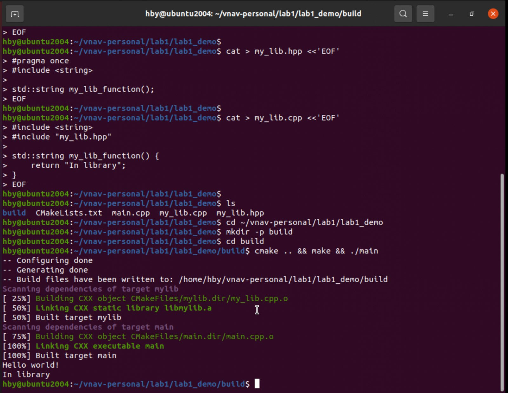

**Figure 06:** Writing `CMakeLists.txt` for the simple test project; the multi-file project builds and prints `Hello world!` and `In library`.

For single files, calling g++ directly is the quickest option; for real projects CMake manages sources, targets and the linking relationship centrally, which is why robot projects use it.

# Part Four: Course and Personal Repositories

The MIT-SPARK/VNAV-labs repository (labs 1–9) was first cloned with the standard HTTPS address (an earlier malformed address asked for a username/password; the correct one fixed it). Then the course repository was cloned as required:

```bash
git clone https://github.com/MIT-SPARK/VNAV-labs.git
git clone https://github.com/ouc-vlab-course/vnav-codes.git ~/vnav-codes
```

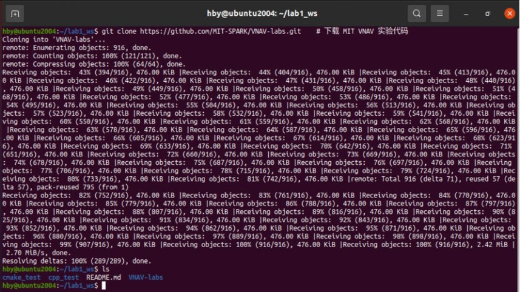

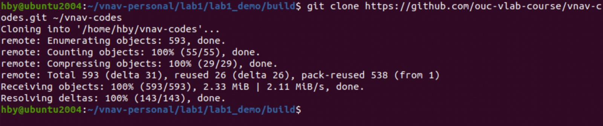

**Figure 07:** MIT VNAV-labs cloned successfully; the course repository clone receives 593 objects and resolves 143 deltas.

The course code lives in `/home/hby/vnav-codes`; its `lab1` folder contains `main.cpp`, `random_vector.cpp` and `random_vector.h`.

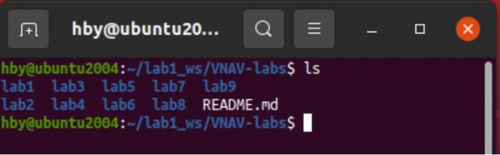

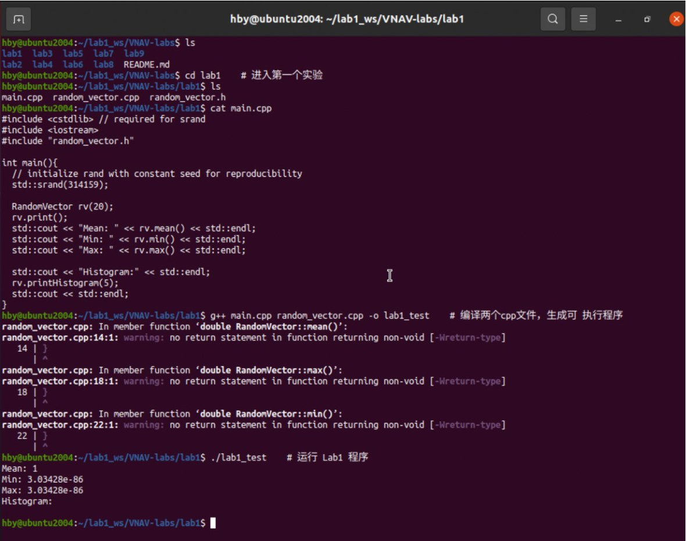

**Figure 08:** Listing the course repository; reading `main.cpp` (the fixed seed `std::srand(314159)`) and the RandomVector interface.

The personal submission repository `hbyhby123/vnav-personal` was created on GitHub and cloned to `~/vnav-personal`, with a `lab1` folder holding all the exercise solutions. Because this is an on-campus course, a public github.com repository replaces the github.mit.edu organization repository. The main branch contains the following pushed revisions:

| Commit | Content |
|---|---|
| `bf9c003` | Completed all Lab 1 exercise files |
| `da39796` | Added the RandomVector implementation |
| `ad2d95a` | Removed the `<algorithm>` header, hand-written max/min loops |
| `3f7f490` | Added exercise1.txt, fixed histogram bins and output direction |
| `55e790b` | Added the four `lab1_demo` project files |
| `c6d80db` | Appended the five fortune outputs |

A final `git status` check shows only build artifacts (`RandomVector/random_vector` and `lab1_demo/build/`) untracked; they were deliberately not committed.

# Part Four: Shell Exercise 1 — dante.txt Statistics

The task is to download the course-specified `dante.txt` with wget, create `exercise1.txt` in `~/vnav-personal/lab1` answering three questions — how many lines, how many words, how many non-blank lines — and push the file to git.

```bash
wget https://raw.githubusercontent.com/dlang/dmd/master/druntime/benchmark/extra-files/dante.txt
wc dante.txt
grep -cv '^[[:space:]]*$' dante.txt
```

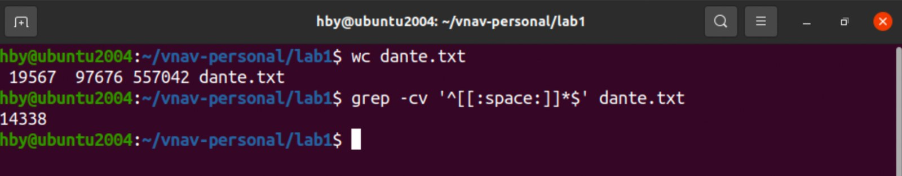

**Figure 09:** `wc` reports `19567 97676 557042 dante.txt` (lines, words, bytes) and `grep -cv` reports 14338 non-blank lines; the same value was double-checked with `grep | wc -l`.

`exercise1.txt`:

```text
Lines: 19567
Words: 97676
Non-blank lines: 14338
```

The result was committed and pushed (commit `3f7f490`). `wc -l` counts lines and `wc -w` counts words; for "non-blank lines" the blank-only lines must first be filtered out with `grep` and then counted with `wc -l`.

# Part Four: Shell Exercise 2 — Appending fortune Outputs

The task is to install `fortune-mod` with apt, run `fortune` once to see a quote, then run `fortune` five more times, each time **appending** the output to `~/vnav-personal/lab1/fortunes.txt` (the file must not be recreated), and push the file to git.

```bash
sudo apt install fortune-mod
fortune
fortune >> ~/vnav-personal/lab1/fortunes.txt   # append #1
fortune >> ~/vnav-personal/lab1/fortunes.txt   # append #2
fortune >> ~/vnav-personal/lab1/fortunes.txt   # append #3
fortune >> ~/vnav-personal/lab1/fortunes.txt   # append #4
fortune >> ~/vnav-personal/lab1/fortunes.txt   # append #5
```

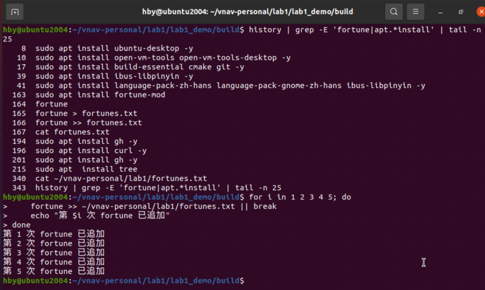

**Figure 10:** Shell history shows `sudo apt install fortune-mod` and the `fortune` calls; all five appends succeeded and the previous content was preserved.

Excerpt of `fortunes.txt` (old content kept, new quotes appended at the end):

```text
You will have a long and unpleasant discussion with your supervisor.
A Tale of Two Cities LITE(tm)
	-- by Charles Dickens
...
Beware of a tall black man with one blond shoe.
April 1
	-- Mark Twain, "Pudd'nhead Wilson's Calendar"
...
```

The file was committed and pushed (commit `c6d80db`). The key lesson: `>` **overwrites** the file while `>>` **appends**; since every new quote must keep the previous ones, `>>` is required.

# Part Four: C++ Warm-Up Exercises

The answers below match `cpp-warmup.txt`, with the numeric-type differences stated more precisely than in the original file.

## Operators

**1.** After the following code, what are the values of `i` and `j`?

```cpp
int i = 0, j;
j = ++i;
j = i++;
```

**Answer:** initially `i = 0`. `j = ++i` increments first (`i = 1`) and assigns `j = 1`; `j = i++` assigns first (`j = 1`) and increments after (`i = 2`). Final values: **i = 2, j = 1**.

**2.** What does the following code print?

```cpp
int i = 42;
std::string output = (i < 42) ? "a" : "b";
std::cout << output << std::endl;
```

**Answer:** `i < 42` is false, so the conditional expression takes the second branch and prints **b**.

## References and Pointers

**1.**
```cpp
int i;
int& ri = i;
i = 5;
ri = 10;
std::cout << i << " " << ri << std::endl;
```
**Answer:** `ri` is a reference to `i`, i.e. the same object. After `ri = 10`, `i` is also 10, so the program prints **10 10**.

**2.**
```cpp
int i = 42;
int* j = &i;
*j = *j**j;
std::cout << *j << std::endl;
```
**Answer:** `*j**j` parses left-to-right as `(*j) * (*j)` = 42 × 42 = **1764**. `*j` and `i` are the same object, so `i` also becomes 1764.

**3.**
```cpp
int i[4] = {42,24,42,24};
*(i+2) = *(i+1)-i[3];
std::cout << *(i+2) << std::endl;
```
**Answer:** `*(i+2)` is `i[2]`, `*(i+1)` is `i[1]` = 24 and `i[3]` = 24, so `i[2] = 24 - 24 = 0` and the program prints **0**. An array name decays to a pointer to its first element, so `i[k]` is the same as `*(i+k)`.

**4.**
```cpp
void reset(int &i) {
    i = 0;
}
int j = 42;
reset(j);
std::cout << j << std::endl;
```
**Answer:** the parameter of `reset` is a reference, so `i = 0` inside the function modifies the caller's `j` directly and the program prints **0**. Reference parameters avoid copies and let a function modify the argument.

## Numbers

**1.** Differences between `int`, `long`, `long long` and `short`?

**Answer:** they are all integer types and differ in storage size and representable range. The standard only guarantees `sizeof(short) <= sizeof(int) <= sizeof(long) <= sizeof(long long)` with minimum widths of 16, 16, 32 and 64 bits respectively, so `long` must not be assumed to be a fixed 4 bytes. On common ARM64 Linux they are 2, 4, 8 and 8 bytes. Pick the smallest type whose range covers the values you need.

**2.** Differences between `float` and `double`? Value of `i` after the snippet?

```cpp
int i;
i = 3.14;
```
**Answer:** `float` is single precision (usually 32 bits, about 6–7 decimal significant digits), `double` is double precision (usually 64 bits, about 15–16 digits), with higher precision and range. Assigning 3.14 to an `int` truncates toward zero, so **i = 3**.

**3.** Differences between `unsigned` and `signed`? Value of `c` (8-bit `char`)?

```cpp
unsigned char c = -1;
```
**Answer:** signed types represent negative, zero and positive values; unsigned types represent only non-negative values and wrap around modulo 2^n. An 8-bit `unsigned char` ranges from 0 to 255; converting -1 to it is -1 mod 256, so **c = 255**.

**4.** Value of `i` after the snippet?

```cpp
int i = 42;
if (i) {
  i = 0;
} else {
  i = 43;
}
```
**Answer:** `i = 42` is non-zero, hence true, so the if-branch runs and **i = 0**.

All answers were cross-checked against `cpp-warmup.txt` and agree.

# Part Four: RandomVector Implementation

The project lives in `lab1/RandomVector`. The header `random_vector.h` declares the interface and `random_vector.cpp` contained TODOs that had to be completed. `main.cpp` fixes the seed with `std::srand(314159)`, so every run produces the same 20 values, which makes the code easy to check.

```cpp
// random_vector.h (interface)
#include <iostream>
#include <vector>

class RandomVector{
  std::vector<double> vect;

  public:
    RandomVector(int size, double max_val = 1);
    void print();
    double mean();
    double max();
    double min();
    void printHistogram(int bins);
};
```

| Function | Purpose |
|---|---|
| `RandomVector(int size, double max_val=1)` | Generate `size` random values in [0, max_val] and store them in `vect` |
| `print()` | Print all values |
| `mean()` | Return the mean of the values |
| `max()` / `min()` | Return the maximum / minimum value |
| `printHistogram(int bins)` | Count values into `bins` equal-width bins between `min()` and `max()` and print the vertical histogram |

Core implementation:

```cpp
RandomVector::RandomVector(int size, double max_val)
{
    for(int i = 0; i < size; i++)
    {
        double value = ((double)rand() / RAND_MAX) * max_val;
        vect.push_back(value);
    }
}

double RandomVector::mean()
{
    double sum = 0;
    for(double v : vect) sum += v;
    return sum / vect.size();
}

double RandomVector::max()
{
    double max_value = vect[0];
    for(double v : vect)
        if(v > max_value) max_value = v;
    return max_value;
}

double RandomVector::min()
{
    double min_value = vect[0];
    for(double v : vect)
        if(v < min_value) min_value = v;
    return min_value;
}
```

Histogram core logic:

```cpp
void RandomVector::printHistogram(int bins)
{
    if (bins <= 0 || vect.empty()) return;

    double low = min();
    double high = max();
    std::vector<int> histogram(bins, 0);

    for (double v : vect)
    {
        int index = 0;
        if (high > low)
        {
            index = static_cast<int>((v - low) / (high - low) * bins);
            if (index >= bins) index = bins - 1;
        }
        histogram[index]++;
    }

    int height = 0;
    for (int count : histogram)
        if (count > height) height = count;

    // print row by row from the top: a bin prints *** while its count reaches the row
    for (int row = height; row > 0; row--)
    {
        for (int i = 0; i < bins; i++)
        {
            if (histogram[i] >= row) std::cout << "***";
            else std::cout << "   ";
            if (i < bins - 1) std::cout << " ";
        }
        std::cout << std::endl;
    }
}
```

Corrections made during development:

1. **Removed the `<algorithm>` header and its function calls** (the course requires not using them); max/min are computed with plain loops (commit `ad2d95a`).
2. **Bins changed from a fixed 0–1 range to `min()`–`max()`** so the histogram uses equal-width bins between the actual minimum and maximum, as the spec requires (commit `3f7f490`).
3. **Output direction changed from horizontal to vertical** to match the teacher's example: one row per level, `***` per filled cell.
4. **Boundary handling:** return immediately when `bins <= 0` or the vector is empty; when all values are equal (`high == low`) everything falls into the first bin; the maximum value falls into the last bin so the index never equals `bins`.
5. `mean`/`max`/`min` assume a non-empty vector; this run contains 20 elements.

# Part Four: Build, Run and Results

The program was first compiled directly with g++ and then built with CMake in a `build` directory and run as `lab1_test`.

```bash
g++ -std=c++11 -Wall -pedantic -o random_vector main.cpp random_vector.cpp
./random_vector
```

```cmake
cmake_minimum_required(VERSION 3.10)
project(vnav_lab1)
add_executable(lab1_test main.cpp random_vector.cpp)
```

```bash
mkdir -p build && cd build
cmake .. && make && ./lab1_test
```

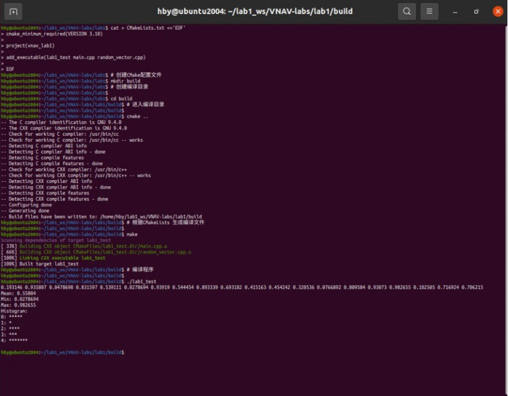

**Figure 11:** Writing CMakeLists.txt and building/running the lab in the build directory.

Final output (fixed seed `std::srand(314159)`, identical on every run):

```text
0.458724 0.779985 0.212415 0.0667949 0.622538 0.999018 0.489585 0.460587 0.0795612
0.185496 0.629162 0.328032 0.242169 0.139671 0.453804 0.083038 0.619352 0.454482
0.477426 0.0904966
Mean: 0.393617
Min: 0.0667949
Max: 0.999018
Histogram:
***     ***
***     ***
***     ***
***     ***
***     ***
***     ***
***     *** ***
*** *** *** *** ***
```

| Metric | Result |
|---|---|
| Number of values | 20 |
| Mean | 0.393617 |
| Min | 0.0667949 |
| Max | 0.999018 |
| Number of bins | 5 |
| Bin counts (bins 0–4) | 8, 1, 8, 2, 1 |
| Histogram height | 8 |

**Reproducibility:** because the seed is fixed to `std::srand(314159)`, every run prints the same 20 values, which makes the output easy to check. The output matches the course website example item by item (Mean 0.393617, Min 0.0667949, Max 0.999018), confirming that the implementation behaves exactly as expected.

# Results Analysis and Problems Solved

## Histogram result

The range from the actual minimum 0.0667949 to the actual maximum 0.999018 is split into five equal-width bins:

| Bin | Range | Count |
|---|---|---|
| 0 | [0.067, 0.253) | 8 |
| 1 | [0.253, 0.440) | 1 |
| 2 | [0.440, 0.626) | 8 |
| 3 | [0.626, 0.813) | 2 |
| 4 | [0.813, 0.999] | 1 |

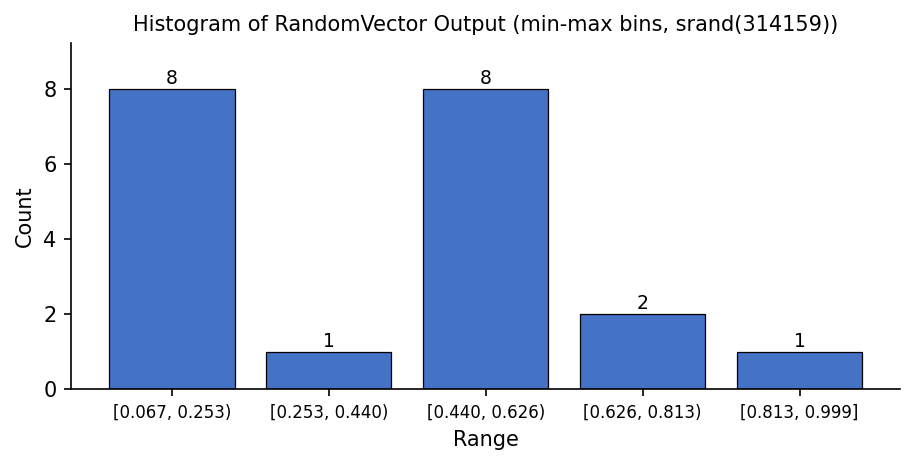

**Figure 12:** Bar chart of the final output. The counts sum to 8+1+8+2+1 = 20, equal to the vector length, which verifies the binning logic; with only 20 samples the histogram is not expected to be smooth.

## An earlier run with an unfixed seed

One actual run recorded during the experiment used a `main.cpp` without the fixed seed and printed Mean 0.55804, Min 0.0278694, Max 0.982655 with bin counts 5, 1, 4, 3, 7 (still summing to 20), compiled without warnings or errors.

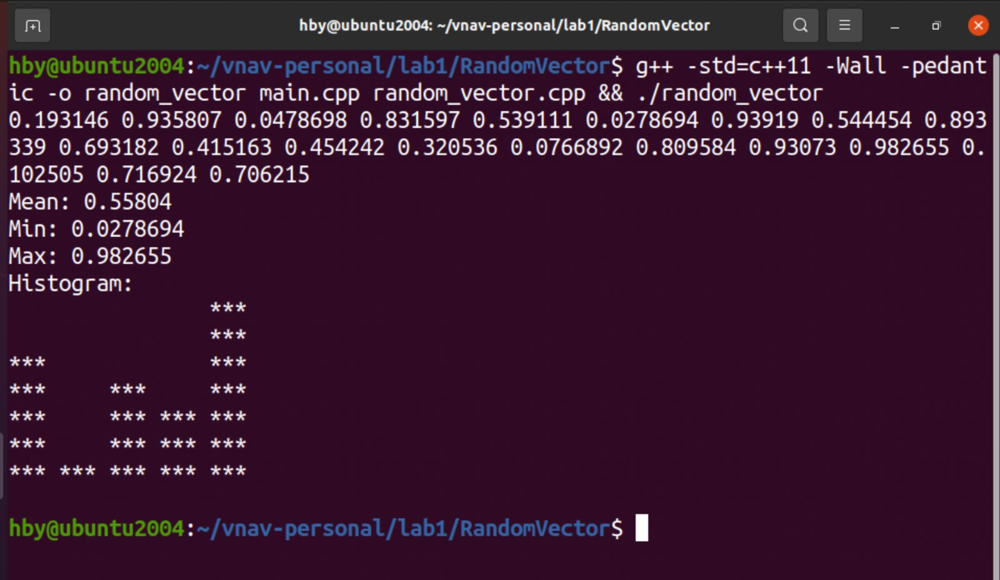

**Figure 13:** An earlier actual run (unfixed seed) whose output differs from the submitted version.

Different random values naturally give a different mean and histogram; that is expected. However, without a fixed seed every run differs, which makes self-checking and grading hard. The submitted version therefore restores the original `std::srand(314159)` from `main.cpp`: the output is stable at Mean 0.393617 (see the previous section) and matches the course example. The exact histogram shape is not required to equal the teacher's example; only the counting logic matters.

## Problems encountered and solutions

| Problem | Cause / symptom | Solution |
|---|---|---|
| `file:/cdrom` error from `apt update` | A leftover CD-ROM entry in the sources | Removed the cdrom entries and re-ran `sudo apt update`; later backed up and switched to the Tsinghua mirror |
| Input-method shortcut clash between Mac and Ubuntu | Ctrl+Space taken by macOS | Changed the shortcut; used an English environment during the lab |
| `git clone` asked for a GitHub username/password | A malformed repository address was used first | Used the standard HTTPS address |
| Compiling before completing the TODOs | `no return statement` warnings and abnormal output | Implemented the functions per the interface and rebuilt |
| Only a text console after the first boot | The system first boots to the terminal login prompt | Logged in, finished the configuration and rebooted into the desktop |
| Histogram bins and direction did not match the spec | Early version used a fixed 0–1 range and horizontal output | Switched to `min()`–`max()` equal-width bins and vertical `***` output (commit `3f7f490`) |
| Used the `<algorithm>` header | The course requires not using its functions | Removed it and hand-wrote the max/min loops (commit `ad2d95a`) |
| `exercise1.txt` missing | Not created yet | Added the `wc` statistics and committed (commit `3f7f490`) |
| Random output not reproducible | The seed was not fixed in `main.cpp` | Restored the course-original `srand(314159)`; the output is stable and matches the course example |

# Conclusion

In this lab I completed the whole pipeline: installing Ubuntu 20.04.5 ARM64 in VMware Fusion and switching to the Tsinghua mirror; installing and verifying build-essential, CMake and Git; practicing basic Linux commands (`ls`, `cd`, `mkdir`, `echo`, `cat`, `wc`, `grep`, ...); Git version management (init, add, commit, log, clone, push) with the course repository and a personal submission repository; single-file g++ compilation and a multi-file CMake project (`lab1_demo` with a library linked to an executable); the Shell exercises (dante.txt: 19567 lines, 97676 words, 14338 non-blank lines; five appended fortune outputs); the C++ warm-up questions committed as `cpp-warmup.txt`; and the complete RandomVector class with six member functions — no `<algorithm>` dependency, `min()`–`max()` equal-width bins, vertical histogram output. The final program deterministically prints 20 random values, the mean, the min/max and the histogram and matches the course example, so all Lab 1 goals are achieved.

The revision also fixed the missing `exercise1.txt`, the histogram range/direction issues and the missing multi-file build evidence. Two practical lessons: `>` overwrites while `>>` appends, and CMake's `add_library`/`target_link_libraries` express the linking relationship explicitly. Before running Git commands, double-check the current directory, and check boundary conditions against the interface specification rather than only testing whether the program runs.
