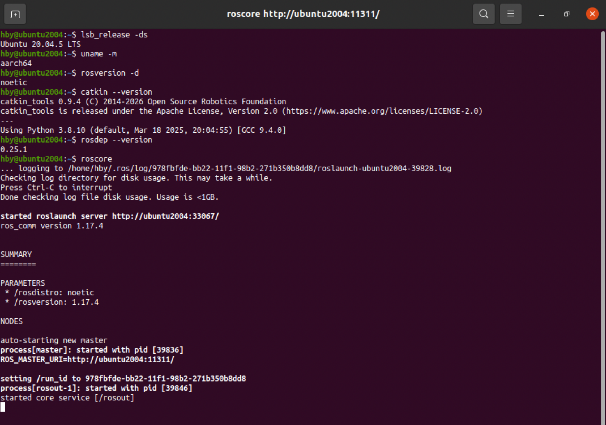
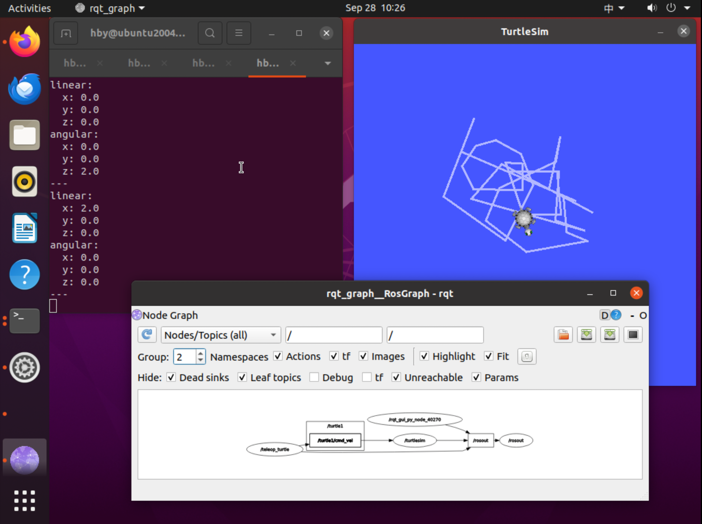
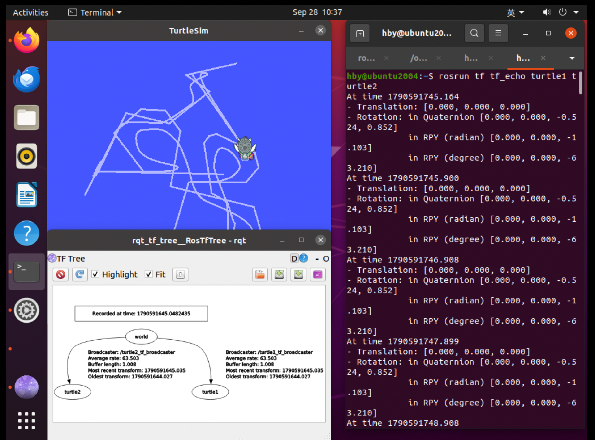
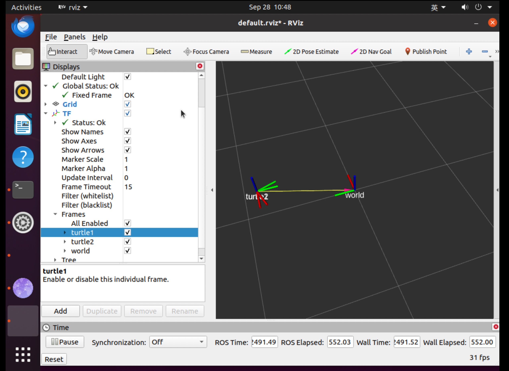
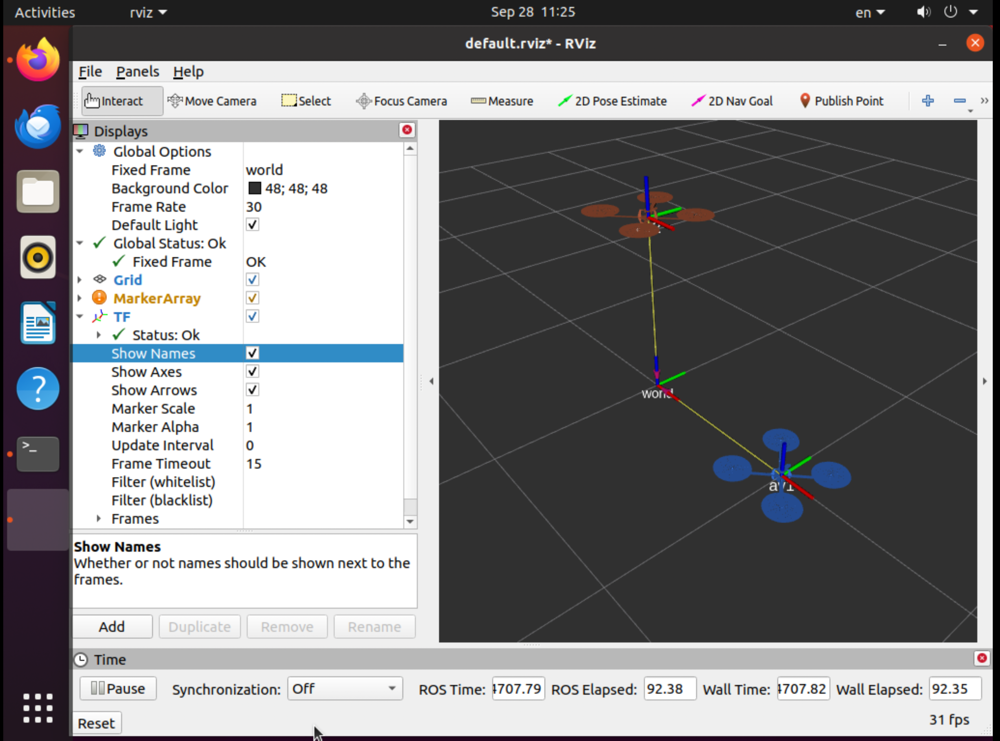
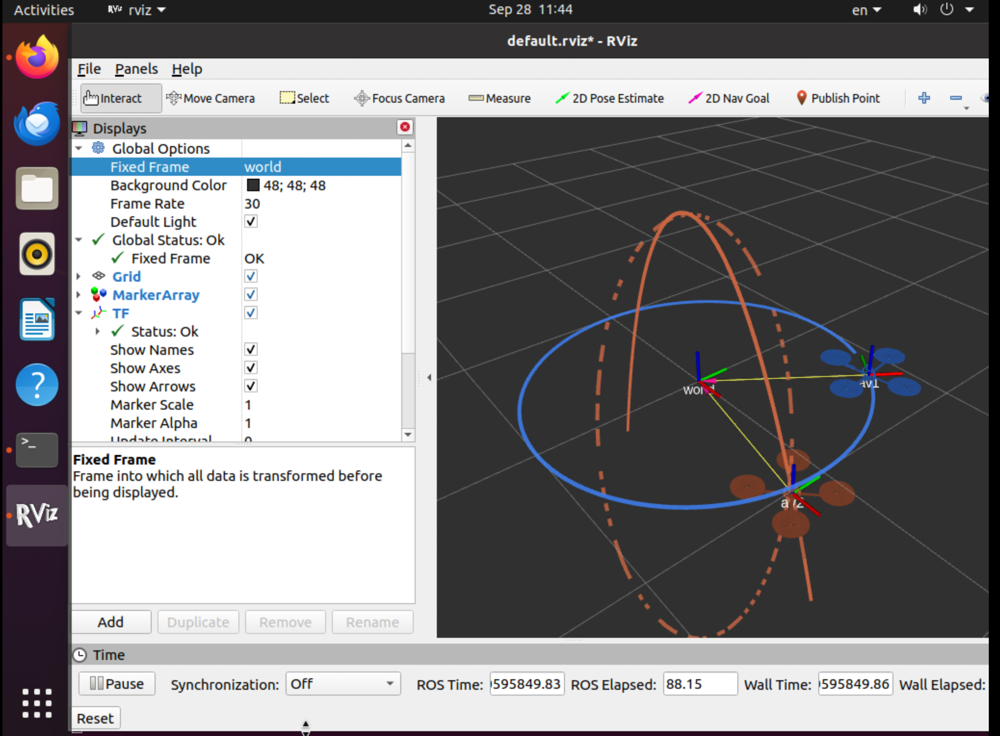
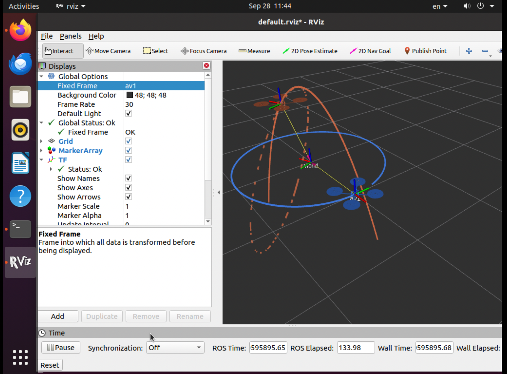

# Lab 2 实验报告：ROS、TF 与齐次变换

## 1. 实验目的与环境

本实验完成 ROS Noetic 安装，练习节点、话题、launch 文件和 TF 工具，实现双无人机的坐标变换发布与相对轨迹查询，并用齐次变换证明相对轨迹为平面椭圆。

| 项目 | 实际环境 |
|---|---|
| 实验设备 | MacBook Air M5，VMware 虚拟机 |
| 实验系统 | Ubuntu 20.04.5 LTS，aarch64（ARM64），主机名 ubuntu2004 |
| ROS | ROS 1 Noetic Desktop-Full，ros_comm 1.17.4 |
| 构建及依赖工具 | catkin_tools 0.9.4、rosdep 0.25.1 |
| Python | 3.8.10 |
| 工作空间 | `/home/hby/vnav_ws` |
| 资料整理 | 在另一台主机 hby-VMware20-1 保存截图和整理报告；ROS 运行结果来自 ubuntu2004 |
| 课程源码基线 | MIT-SPARK/VNAV-labs，提交 `609f31fec484daafef6207ce283d23b424a2072f`（ROS 1） |
| 实验源码提交 | 个人仓库提交 `03918a9` |

实验按照 2023 年 ROS 1 讲义进行。课程仓库当前默认版本使用 ROS 2 的 `ament_cmake`，因此采用上述 ROS 1 历史版本。本目录包含完整软件包、7张原始实验截图及本报告。公式以 LaTeX 排版，可在 GitHub 中阅读。

## 2. ROS 安装与入门验证

### 2.1 安装

确认系统为 Ubuntu focal、架构为 aarch64 后，配置 ROS ARM64 软件源和签名密钥，安装 `ros-noetic-desktop-full`。在 `~/.bashrc` 中配置：

```bash
source /opt/ros/noetic/setup.bash
```

安装构建依赖并初始化 rosdep：

```bash
sudo apt install python3-rosdep python3-rosinstall python3-rosinstall-generator python3-vcstool build-essential python3-catkin-tools python-is-python3
sudo rosdep init
rosdep update --include-eol-distros
```

更新输出包含 `Add distro "noetic"`，缓存成功写入。`rosversion -d` 返回 `noetic`，`roscore` 输出 `started core service [/rosout]`，表明核心服务正常启动。



**图01：** Ubuntu 版本、CPU 架构、ROS 和开发工具版本，以及 ROS Master 启动结果。

### 2.2 节点与话题

分别运行 `roscore`、`rosrun turtlesim turtlesim_node` 和 `rosrun turtlesim turtle_teleop_key`，通过方向键控制海龟。`rosnode list` 显示 `/rosout`、`/turtlesim` 和 `/teleop_turtle`。

使用 `rosrun rqt_graph rqt_graph` 查看通信关系，使用 `rostopic echo /turtle1/cmd_vel` 查看消息：

```text
/teleop_turtle → /turtle1/cmd_vel → /turtlesim
```

键盘节点发布速度指令，海龟节点订阅并执行。消息中的 `linear.x` 控制前后运动，`angular.z` 控制转向。ROS Master 提供命名与注册服务，帮助节点发现彼此；实际数据由节点之间传输。



**图02：** 海龟运动轨迹、速度消息及节点—话题通信图。

### 2.3 TF 与 RViz

运行以下工具（各持续运行的程序使用独立终端）：

```bash
roslaunch turtle_tf turtle_tf_demo.launch
rosrun rqt_tf_tree rqt_tf_tree
rosrun tf tf_echo turtle1 turtle2
rviz
```

观察到另一只海龟跟随受控海龟运动。TF 树为 `world` 分别连接 `turtle1`、`turtle2`。`tf_echo turtle1 turtle2` 给出 turtle2 在 turtle1 坐标系中的位置和朝向。截图时二者位置基本重合，但相对 yaw 约为 −63.21°，说明位置重合不代表姿态相同。



**图03：** 双海龟跟随、TF 树及相对变换输出。

RViz 中设置 Fixed Frame 为 `world`，添加 TF 并启用 Show Names。红、绿、蓝坐标轴分别对应 x、y、z。缩小视图后可见全部坐标系，TF 状态为 OK。



**图04：** world 与两只海龟坐标系的可视化；海龟跟随到相近位置时，其名称和坐标轴可能重叠。

## 3. 工作空间与复现方法

初始化 `~/vnav_ws`，将课程 ROS 1 软件包复制到 `src` 后运行 `catkin build`。实际输出包含 `Finished <<< two_drones_pkg`、`All 1 packages succeeded!`，没有跳过软件包。

在已安装 ROS Noetic 及课程依赖的环境中，可从本仓库复现。以下假定个人仓库位于 `~/vnav-personal`，目标工作空间尚未包含同名软件包：

```bash
source /opt/ros/noetic/setup.bash
mkdir -p ~/vnav_ws/src
cd ~/vnav_ws
catkin init
cp -a ~/vnav-personal/lab2/two_drones_pkg ~/vnav_ws/src/
catkin build
source ~/vnav_ws/devel/setup.bash
roslaunch two_drones_pkg two_drones.launch static:=True
```

停止静态场景后，不带 `static:=True` 启动动态场景：

```bash
roslaunch two_drones_pkg two_drones.launch
```

新终端需要重新执行 `source ~/vnav_ws/devel/setup.bash`。`roslaunch` 在没有 Master 时可自动启动它。RViz 中启用 MarkerArray 和 TF；分别将 Fixed Frame 设为 `world`、`av1` 观察结果。

## 4. Deliverable 1：节点、话题与 launch 文件

### 4.1 静态场景的节点

实际 `rosnode list` 输出：

```text
/av1broadcaster
/av2broadcaster
/plots_publisher_node
/rosout
/rviz
```

除题目允许忽略的日志节点 `/rosout` 外，共有四个功能节点。两个静态发布节点分别发布 world 到 av1、av2 的变换；位置为 `(1,0,0)`、`(0,0,1)`，四元数均为 `(0,0,0,1)`。



**图05：** 蓝色 AV1、红色（显示为橙红色）AV2 及 TF 坐标轴。此图采集于轨迹标记警告修复前；TF 和全局状态为 OK，MarkerArray 的橙色提示在后续代码修改中解决。

### 4.2 不使用 roslaunch 的等效启动方法

先停止 launch 启动的场景，再在五个独立终端执行以下命令，各终端预先加载 ROS 环境。实验已实际验证这些命令能够重现两架静止无人机。

```bash
# 终端1
roscore

# 终端2
rosrun tf2_ros static_transform_publisher 1 0 0 0 0 0 1 world av1 __name:=av1broadcaster

# 终端3
rosrun tf2_ros static_transform_publisher 0 0 1 0 0 0 1 world av2 __name:=av2broadcaster

# 终端4
source ~/vnav_ws/devel/setup.bash
rosrun two_drones_pkg plots_publisher_node

# 终端5
source ~/vnav_ws/devel/setup.bash
rosrun rviz rviz -d "$(rospack find two_drones_pkg)/config/default.rviz" __name:=rviz
```

手动验证时未给 RViz 指定 `__name`，曾出现自动生成名称的 RViz 节点；上面补充名称参数，使节点名也与 launch 文件一致。

### 4.3 发布与订阅关系

通过 `rosnode info` 和 `rostopic info /visuals` 获取以下结果，表中省略所有节点发布的 `/rosout` 日志话题：

| 节点 | 发布的话题 | 订阅的话题 |
|---|---|---|
| `/av1broadcaster` | `/tf_static` | 无 |
| `/av2broadcaster` | `/tf_static` | 无 |
| `/plots_publisher_node` | `/visuals` | `/tf`、`/tf_static` |
| `/rviz` | `/clicked_point`、`/initialpose`、`/move_base_simple/goal` | `/tf`、`/tf_static`、`/visuals` |

`/tf_static` 的消息类型为 `tf2_msgs/TFMessage`；`/visuals` 为 `visualization_msgs/MarkerArray`，发布者为 `/plots_publisher_node`，订阅者为 `/rviz`。因此无人机网格模型来自 `/visuals`，其空间位置由 TF 关系确定。RViz 的交互话题在使用相应工具时输出消息，不表示它们持续发送。

### 4.4 省略 static:=True 的变化

launch 文件的 `static` 默认值为 `false`。`<group if="$(arg static)">` 只在参数为真时启动两个静态发布器；`unless="$(arg static)"` 在参数为假时启动 `/frames_publisher_node`。

因此省略参数后，两个静态发布节点被动态发布节点替代，plots 和 RViz 仍启动。模板的运动代码未补全时没有正确的动态变换；完成 Deliverable 2 后，两架无人机按指定轨迹运动。关闭残留 RViz 后，动态场景的功能节点为 `/frames_publisher_node`、`/plots_publisher_node`、`/rviz`，另有日志节点 `/rosout`。

## 5. Deliverable 2：发布运动变换

源码：[frames_publisher_node.cpp](two_drones_pkg/src/frames_publisher_node.cpp)。

节点以 0.02 秒定时器周期（名义 50 Hz）执行回调，以节点启动后的秒数为时间变量；两个变换使用同一时间戳，父坐标系均为 `world`，子坐标系分别为 `av1`、`av2`。

$$
o_1^w(t)=(\cos t,\sin t,0)^T,\qquad
o_2^w(t)=(\sin t,0,\cos 2t)^T.
$$

AV1 使用 `q.setRPY(0.0, 0.0, time)`；AV2 采用单位四元数。AV1 的旋转矩阵为：

$$
R_1^w(t)=\begin{bmatrix}\cos t&-\sin t&0\\\sin t&\cos t&0\\0&0&1\end{bmatrix}.
$$

第二列为 AV1 的 y 轴方向 $(-\sin t,\cos t,0)^T$，恰好等于其位置对时间的导数；第三列为世界 z 轴。因此满足题目要求的 y 轴沿运动方向、z 轴平行世界 z 轴。最后用 `broadcaster.sendTransform` 发布两个变换。

实际编译并启动后，两架无人机开始运动。这里验证的是几何运动，不考虑真实四旋翼的动力学可行性；50 Hz 是代码设定值，未单独进行实测频率统计。

## 6. Deliverable 3：查询变换与显示轨迹

源码：[plots_publisher_node.cpp](two_drones_pkg/src/plots_publisher_node.cpp)。补全的核心语句为：

```cpp
transform = parent->tf_buffer.lookupTransform(
    ref_frame, dest_frame, ros::Time(0));
```

第一参数是表达结果的参考坐标系（target），第二参数是目标物体坐标系（source）；返回将 dest_frame 中的坐标转换到 ref_frame 的变换。其平移部分即目标坐标系原点在参考坐标系中的位置。`ros::Time(0)` 查询最新可用变换，不是查询仿真起始时刻。

分别查询 `(world,av1)`、`(world,av2)`、`(av1,av2)`，得到蓝色世界轨迹、红色世界轨迹和红色虚线相对轨迹。历史点存放在各自的参考坐标系中：AV1 相对轨迹标记使用 `av1` 作为 frame_id，所以在 world 视图中会随当前 AV1 姿态一起变换，不能把它误当成 AV2 的世界历史轨迹。

同时进行了两处修正：设置轨迹 Marker 的 `pose.orientation.w = 1.0`，消除零四元数警告；将 `tf_buffer` 声明放在 `tf_listener` 前，保证被监听器引用的对象先构造。



**图06：** Fixed Frame 为 world。蓝色实线为 AV1 圆形轨迹，橙红色实线为 AV2 抛物线段，虚线为转换到当前 world 视图中的相对轨迹。截图视野边缘裁到了部分虚线，但两条世界轨迹及状态可辨识。



**图07：** Fixed Frame 为 av1。AV1 在此参考系中静止，AV2 的虚线轨迹呈倾斜平面椭圆。全局与 TF 状态正常，MarkerArray 的原四元数警告已消除。

轨迹采用有限缓存：世界轨迹各300点，相对轨迹160点；在名义50 Hz下分别覆盖约6秒和3.2秒。世界圆的周期为 $2\pi$ 秒，因此截图中蓝色圆可能有小缺口；相对椭圆周期为 $\pi$ 秒。有限采样及视角投影不改变解析轨迹的几何性质。

## 7. Deliverable 4：齐次变换与椭圆推导

约定 ${}^{A}T_B$ 将 B 系坐标转换到 A 系；使用列向量，记 $c=\cos t$、$s=\sin t$。

### 7.1 AV2 的世界轨迹是抛物线段

由 $x_w=\sin t$、$y_w=0$、$z_w=\cos2t=1-2\sin^2t$，消去时间：

$$
\boxed{y_w=0,\quad z_w=1-2x_w^2,\quad -1\le x_w\le1.}
$$

这是 x-z 平面内开口向下的抛物线段，AV2 随时间往返运动。

### 7.2 AV2 相对于 AV1 的位置

两个世界齐次变换为：

$$
{}^WT_1=\begin{bmatrix}c&-s&0&c\\s&c&0&s\\0&0&1&0\\0&0&0&1\end{bmatrix},\qquad
{}^WT_2=\begin{bmatrix}1&0&0&s\\0&1&0&0\\0&0&1&\cos2t\\0&0&0&1\end{bmatrix}.
$$

利用刚体变换求逆公式：

$$
\begin{bmatrix}R&p\\0&1\end{bmatrix}^{-1}
=\begin{bmatrix}R^T&-R^Tp\\0&1\end{bmatrix},\qquad
{}^1T_W=\begin{bmatrix}c&s&0&-1\\-s&c&0&0\\0&0&1&0\\0&0&0&1\end{bmatrix}.
$$

组合得到：

$$
{}^1T_2={}^1T_W{}^WT_2
=\begin{bmatrix}c&s&0&cs-1\\-s&c&0&-s^2\\0&0&1&\cos2t\\0&0&0&1\end{bmatrix}.
$$

所以相对位置为：

$$
\boxed{o_2^1(t)=\begin{bmatrix}\frac12\sin2t-1\\\frac12\cos2t-\frac12\\\cos2t\end{bmatrix}.}
$$

### 7.3 轨迹平面

在 AV1 系中记位置为 $(x,y,z)$。由 $y=(\cos2t-1)/2$、$z=\cos2t$ 得：

$$
\boxed{\Pi:\ z-2y-1=0.}
$$

因此轨迹全部位于固定平面上，法向量可取 $(0,-2,1)^T$。

### 7.4 建立平面坐标系

取中心 $p^1=(-1,-1/2,0)^T$，选择右手正交单位基：

$$
e_u=(1,0,0)^T,\quad e_v=(0,1,2)^T/\sqrt5,\quad e_n=(0,-2,1)^T/\sqrt5.
$$

$e_u\times e_v=e_n$，且 $e_u,e_v$ 均在轨迹平面内。新坐标系 P 到 AV1 的变换及其逆为：

$$
{}^1T_P=\begin{bmatrix}
1&0&0&-1\\0&1/\sqrt5&-2/\sqrt5&-1/2\\0&2/\sqrt5&1/\sqrt5&0\\0&0&0&1
\end{bmatrix},
$$

$$
{}^PT_1=\begin{bmatrix}
1&0&0&1\\0&1/\sqrt5&2/\sqrt5&1/(2\sqrt5)\\0&-2/\sqrt5&1/\sqrt5&-1/\sqrt5\\0&0&0&1
\end{bmatrix}.
$$

作用于相对位置的齐次坐标：

$$
\begin{bmatrix}u\\v\\n\\1\end{bmatrix}
={}^PT_1\begin{bmatrix}x\\y\\z\\1\end{bmatrix}
=\begin{bmatrix}\frac12\sin2t\\\frac{\sqrt5}{2}\cos2t\\0\\1\end{bmatrix}.
$$

法向分量始终为零，平面二维坐标为 $(u,v)$，轨迹中心已移至原点。

### 7.5 椭圆及半轴长度

消去时间，利用平方和恒等式：

$$
\boxed{\frac{u^2}{(1/2)^2}+\frac{v^2}{(\sqrt5/2)^2}=1.}
$$

该曲线关于 u、v 轴对称，是以原点为中心的椭圆。长半轴沿 $e_v$，长度 $\sqrt5/2\approx1.118$；短半轴沿 $e_u$，长度 $1/2=0.5$。这与图07的相对轨迹一致。

## 8. Deliverable 5：四元数性质

采用题目约定，向量部分在前、标量部分在后：$q=(v,w)$，$v=(q_1,q_2,q_3)^T$、$w=q_4$。令 $V=[v]_\times$，即 $Va=v\times a$，则：

$$
\Omega_1(q)=\begin{bmatrix}wI_3+V&v\\-v^T&w\end{bmatrix},\qquad
\Omega_2(q)=\begin{bmatrix}wI_3-V&v\\-v^T&w\end{bmatrix}.
$$

其中 $\Omega_1(q)p=q\otimes p$、$\Omega_2(q)p=p\otimes q$。共轭为 $\bar q=(-v,w)$，故 $\Omega_i(q)^T=\Omega_i(\bar q)$。

### 8.1 正交性及直观解释

令 $M_\sigma=\begin{bmatrix}wI_3+\sigma V&v\\-v^T&w\end{bmatrix}$，$\sigma=\pm1$ 分别对应两种算子。利用 $V^T=-V$、$Vv=0$、$V^2=vv^T-\|v\|^2I_3$，计算：

$$
M_\sigma^TM_\sigma=
\begin{bmatrix}w^2I_3-V^2+vv^T&-\sigma Vv\\\sigma v^TV&w^2+v^Tv\end{bmatrix}
=(w^2+\|v\|^2)I_4.
$$

单位四元数满足 $w^2+\|v\|^2=1$，所以 $M_\sigma^TM_\sigma=I_4$。矩阵为方阵，因此其逆为转置，也有 $M_\sigma M_\sigma^T=I_4$，两种算子均正交。

直观上，四元数范数具有乘法性，单位四元数的左乘或右乘保持任意四维向量的长度；这种线性等距变换对应正交矩阵。

### 8.2 转换为单位旋转四元数

对单位 q，$\bar q\otimes q=q\otimes\bar q=e$，$e=(0,0,0,1)^T$，因此：

$$
\boxed{\Omega_1(q)^Tq=\bar q\otimes q=e,\qquad
\Omega_2(q)^Tq=q\otimes\bar q=e.}
$$

单位旋转对应“旋转与其逆相互抵消”。

### 8.3 两种算子的交换关系

对任意 $x,y,p\in\mathbb R^4$，由四元数乘法结合律：

$$
\Omega_1(x)\Omega_2(y)p=x\otimes(p\otimes y)
=(x\otimes p)\otimes y=\Omega_2(y)\Omega_1(x)p.
$$

由于 p 任意，得：

$$
\boxed{\Omega_1(x)\Omega_2(y)=\Omega_2(y)\Omega_1(x).}
$$

再将 y 换为其共轭，结合 $\Omega_2(y)^T=\Omega_2(\bar y)$：

$$
\boxed{\Omega_1(x)\Omega_2(y)^T=\Omega_2(y)^T\Omega_1(x).}
$$

这里不要求 x、y 为单位四元数；交换的是左乘与右乘算子，不是四元数乘法本身。

## 9. Deliverable 6（可选）：内禀与外禀旋转

设姿态矩阵 R 将物体坐标转换到世界坐标。对物体系向量 p，其世界坐标为 Rp。绕世界固定轴施加旋转 A 后，$p'=A(Rp)$，所以新姿态为 $AR$，即左乘。

绕物体局部轴施加旋转 B，其在世界系中的算子为 $RBR^{-1}$，于是新姿态为 $(RBR^{-1})R=RB$，即右乘。

从相同的对齐姿态 $R=I$ 开始，外禀按 $R_0,R_1,R_2$ 顺序执行，最终为 $R_2R_1R_0$；内禀按反序 $R_2,R_1,R_0$ 执行，最终也为 $R_2R_1R_0$。因此二者最终姿态相同。对任意 n 次旋转，同理均得到 $R_{n-1}\cdots R_1R_0$。

题目示例为 $R_0=R_x(90^\circ)$、$R_1=R_y(180^\circ)$、$R_2=R_x(-30^\circ)$，共同结果为：

$$
R_2R_1R_0=
\begin{bmatrix}-1&0&0\\0&-1/2&-\sqrt3/2\\0&-\sqrt3/2&1/2\end{bmatrix}.
$$

这里的同轴标签与反序等价性以初始局部轴和固定轴对齐为前提。若初始姿态任意，两类最终乘积分别为 $R_{n-1}\cdots R_0R_{\mathrm{init}}$ 和 $R_{\mathrm{init}}R_{n-1}\cdots R_0$，不能直接断言相等。

## 10. 问题处理与实验结论

| 问题 | 原因及处理 |
|---|---|
| 软件源配置命令报错 | 两条命令粘连为 `.ascecho`；分开执行后软件源与密钥配置成功 |
| catkin 将主目录识别为工作空间 | 主目录存在 `.catkin_tools`；将其改名备份后，在 `~/vnav_ws` 初始化 |
| 构建显示 succeeded 但跳过实验包 | 默认源码使用 `ament_cmake`；切换 ROS 1 历史版本后真正编译了 `two_drones_pkg` |
| RViz 初始只看到 world | 缩小视图并检查 TF Frames 后显示全部坐标系 |
| 静态 MarkerArray 四元数警告 | 轨迹 Marker 的姿态默认全零；设置 `orientation.w=1.0` 后消除 |
| 残留空白 RViz 窗口 | 关闭旧的独立 RViz，保留当前 launch 启动的实例，并检查节点列表 |
| 修改脚本提示内容不匹配 | 检查文件发现三处修改已存在，避免重复替换，直接重新编译运行 |

实验完成了 ROS 安装、节点话题通信、TF 树与 RViz 验证；实现并运行了两个动态变换与三条轨迹。运行观察和数学推导一致：AV1 在世界系中走圆形，AV2 走抛物线段；AV2 在 AV1 系中的轨迹位于 $z-2y-1=0$ 平面，是长短半轴分别为 $\sqrt5/2$ 和 $1/2$ 的椭圆。截图为实际操作证据；数学证明为解析推导，未将截图观察当作定量误差测试。

## 11. 参考资料

1. [MIT VNAV 2023 — Installing ROS](https://vnav.mit.edu/labs_2023/lab2/ros.html)
2. [MIT VNAV 2023 — Introduction to ROS](https://vnav.mit.edu/labs_2023/lab2/ros101.html)
3. [MIT VNAV 2023 — Lab 2 Exercises](https://vnav.mit.edu/labs_2023/lab2/exercises.html)
4. [MIT-SPARK/VNAV-labs ROS 1 源码基线](https://github.com/MIT-SPARK/VNAV-labs/tree/609f31fec484daafef6207ce283d23b424a2072f/lab2/two_drones_pkg)

报告根据实验聊天记录、终端实际输出、7张截图及已提交源码整理；文字和推导由 AI 辅助编写，实验操作由本人在 ubuntu2004 上完成。
